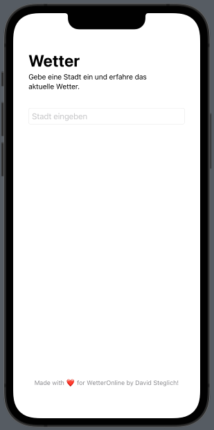
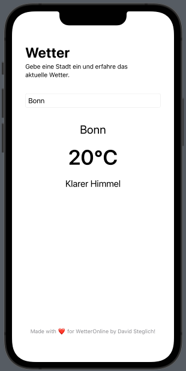
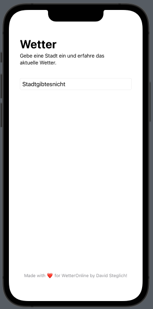

# WetterOnline Demo App

Eine einfache Wetter-App in Swift für WetterOnline, mit der man das aktuelle Wetter einer Stadt abfragen kann.

---

## Features

- Eingabe einer Stadt
- Anzeige von Temperatur und Wetterzustand
- Benutzerfreundliche Oberfläche

---

## Screenshots

### 1. Keine Stadt eingegeben



### 2. Stadt "Bonn" eingegeben



### 3. Nicht existierende Stadt eingegeben



---

## Installation

1. Klone das Repository:
   ```bash
   git clone https://github.com/dein-benutzername/wetterOnline_demoApp.git
   ```
2. Projekt in Xcode öffnen
3. Secrets.xcconfig im Root-Verzeichnis des Projekts erstellen mit API Key von OPENWEATHERMAP erstellen:
   ```bash
   OPENWEATHERMAP_API_KEY = beispielAPIKey123
   ```
4. Projekt bauen

---

## Kontakt

E-Mail: info@davidsteglich.de

---

Made with ❤️ for WetterOnline by David Steglich!
